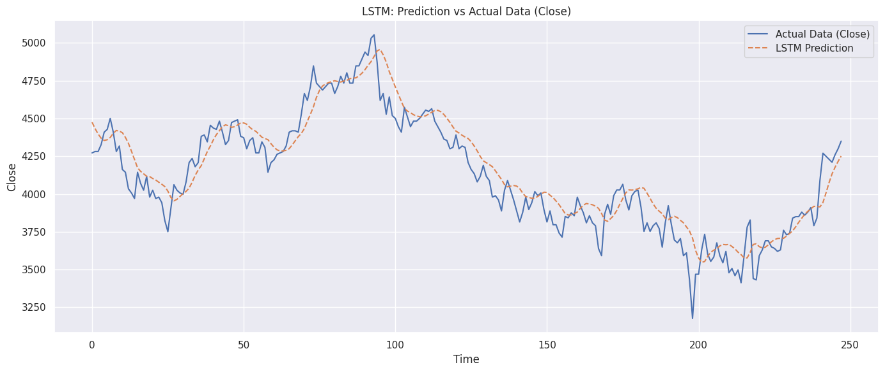
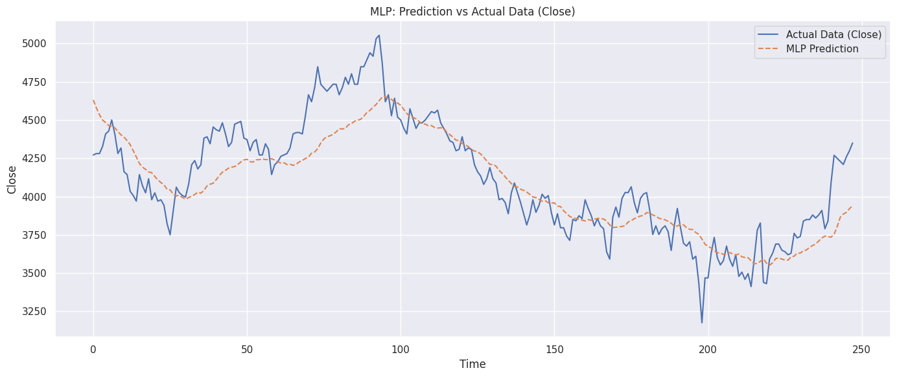
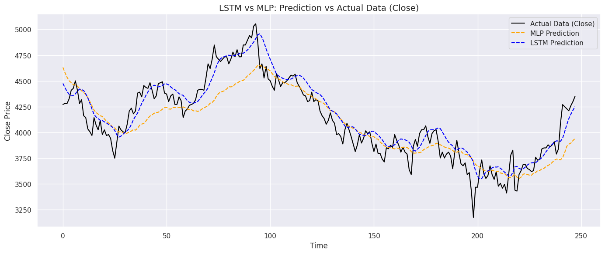
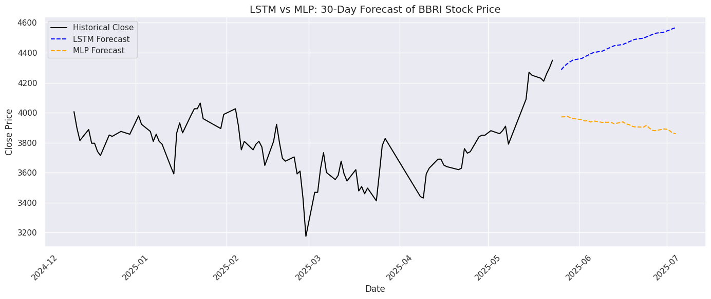

# Laporan Proyek Machine Learning - Mohammad Valeriant Qumara Tanda

## Domain Proyek

Investasi di pasar saham telah menjadi salah satu pilar utama dalam pengelolaan kekayaan dan pertumbuhan ekonomi, baik oleh individu maupun institusi. Namun, tingginya volatilitas dan kompleksitas pasar menjadikan prediksi harga saham sebagai tantangan tersendiri. Dalam konteks ini, pemanfaatan _machine learning_, khususnya teknik forecasting berbasis data historis, menjadi sangat relevan.

Proyek ini berfokus pada prediksi harga saham PT Bank Rakyat Indonesia Tbk (BBRI), salah satu emiten terbesar dan paling aktif di Bursa Efek Indonesia. Dengan menggunakan dataset `BBRI_Stock.csv` yang diperoleh melalui proses ETL sederhana, proyek ini membangun model _forecasting_ berbasis _time series_ yang diimplementasikan dalam _notebook_ `main.ipynb`.

Permasalahan prediksi harga saham bukanlah isu baru. Penelitian sebelumnya telah menunjukkan bahwa model seperti ARIMA, LSTM, dan Prophet memiliki potensi besar dalam menganalisis dan memprediksi pergerakan harga saham berdasarkan pola masa lalu [1][2]. Dengan pendekatan ini, investor atau analis dapat mengurangi ketidakpastian dalam pengambilan keputusan, serta memaksimalkan peluang keuntungan di pasar.

>“Forecasting the stock price is essential for investors to plan their investment strategy and to manage risks accordingly” [1].
>“LSTM networks are particularly effective in modeling time series data due to their ability to remember long-term dependencies” [2].

Dengan latar belakang tersebut, proyek ini tidak hanya relevan secara teknis tetapi juga aplikatif dalam dunia nyata.

## Business Understanding

### Problem Statements

1. Bagaimana memprediksi harga penutupan (closing price) saham BBRI pada periode mendatang secara akurat?
2. Apa dampak dari pemilihan model _machine learning_ tertentu terhadap akurasi hasil prediksi?

### Goals

1. Menghasilkan model prediktif yang mampu memperkirakan harga saham BBRI berdasarkan data historis.
2. Mengevaluasi performa model _forecasting_ yang digunakan dan mengidentifikasi pendekatan terbaik.

### Solution Statements

- Menggunakan model **Long Short-Term Memory (LSTM)** dan **MultiLayer Perceptron (MLP)** sebagai _baseline_ untuk memprediksi harga saham karena kemampuannya dalam mengenali pola jangka panjang pada data _time series_.
- Melakukan _data normalization_ dan _sequence windowing_ agar struktur data cocok dengan input LSTM dan MLP.
- Mengukur performa model dengan metrik _Root Mean Squared Error_ (RMSE), _Mean Absolute Error_ (MAE), dan _Mean Absolute Percentage Error_ (MAPE) agar dapat dibandingkan secara kuantitatif dan terukur.
- Menyediakan visualisasi hasil prediksi vs data aktual untuk validasi visual serta pengambilan insight tambahan.

## Data Understanding

Dataset yang digunakan dalam proyek ini berisi data historis harga saham PT Bank Rakyat Indonesia Tbk (BBRI) yang diperoleh melalui proses ETL sederhana dari sumber pasar modal. Dataset disimpan dalam file `BBRI_Stock.csv` dan mencakup periode waktu tertentu dengan frekuensi harian.

### Informasi Dataset

Berikut adalah informasi dataset yang digunakan:

- Nama Dataset: `BBRI_Stock.csv`.
- Sumber Dataset: [Yahoo Finance](https://finance.yahoo.com/quote/BBRI.JK/).
- Periode Waktu Pengambilan Dataset: 5 tahun.
- Jumlah Dataset: 1299 Baris x 5 Kolom.
- Kondisi Dataset: Tidak ada missing values, duplikasi data, dan outlier.

### Variabel-variabel dalam Dataset

Berikut adalah deskripsi fitur-fitur yang terdapat dalam dataset:

- Date: Tanggal perdagangan saham.
- Unnamed: 0: Penomoran baris dimulai dari indeks 0.
- Open: Harga pembukaan saham pada hari tersebut.
- High: Harga tertinggi yang dicapai saham dalam sehari.
- Low: Harga terendah yang dicapai saham dalam sehari.
- Close: Harga penutupan saham.

### Analisis Awal (EDA)

Beberapa langkah eksplorasi awal dilakukan untuk memahami struktur dan perilaku data, antara lain:

1. Visualisasi Time Series: Grafik garis untuk memantau tren harga saham dari waktu ke waktu.
2. Distribusi pada Open, High, Low, dan Close: Histogram dan boxplot digunakan untuk melihat penyebaran dan outlier.
Langkah ini membantu memastikan bahwa data yang digunakan memiliki kualitas baik dan siap diproses ke tahap selanjutnya.

## Data Preparation

Tahapan data preparation dilakukan untuk memastikan bahwa data historis harga saham BBRI siap digunakan dalam pemodelan time series, khususnya dengan model LSTM.

### Langkah-langkah Data Preparation

1. Seleksi Kolom Fitur

- Hanya kolom `Close` yang digunakan untuk prediksi karena merepresentasikan harga penutupan harian, yang sering menjadi fokus utama dalam analisis saham. Selain itu, kolom `Unnamed: 0` akan dihapus karena tidak memiliki nilai yang relevan untuk model. Meskipun hanya kolom `Close` yang digunakna untuk prediksi, penghapusan kolom `Unnamed: 0` diperlukan untuk memastikan kebersihan data sebelum modeling.

1. Normalisasi Data

- Data `Close` dinormalisasi menggunakan metode MinMaxScaler dari scikit-learn ke rentang [0, 1]. Hal ini penting untuk mempercepat konvergensi model neural network dan menghindari dominasi skala fitur tertentu. Selain itu, normalisasi dilakukan untuk stabilitas pelatihan pada model.

  ```python
  from sklearn.preprocessing import MinMaxScaler
  scaler = MinMaxScaler()
  scaled_data = scaler.fit_transform(close_price.reshape(-1, 1))
  ```

3. Pembentukan Jendela Waktu (Windowing)
  
- Untuk mengubah data time series menjadi format yang bisa diproses oleh LSTM, digunakan pendekatan sliding window. Misalnya, setiap 60 data sebelumnya digunakan untuk memprediksi data ke-61.

  ```python
  def create_sequences(data, lookback=60):
    X, y = [], []
    for i in range(len(data) - lookback):
        X.append(data[i:i + lookback])  # Sequence of 'lookback' time steps
        y.append(data[i + lookback])    # Next time step
    return np.array(X), np.array(y)
  ```

4. Pemisahan Data Latih dan Uji

- Dataset dibagi menjadi data latih dan data uji (train-test split) berdasarkan urutan waktu, tanpa melakukan pengacakan, agar menjaga kontinuitas temporal.

5. Reshape Data untuk LSTM

- Input data diubah ke format `[samples, time steps, features]` agar kompatibel dengan arsitektur LSTM.

  ```python
  X_train = X_train.reshape(X_train.shape[0], X_train.shape[1], 1)
  X_test = X_test.reshape(X_test.shape[0], X_test.shape[1], 1)
  ```

## Modeling

Untuk menyelesaikan permasalahan forecasting harga saham BBRI, proyek ini menggunakan dua pendekatan model deep learning: **Long Short-Term Memory (LSTM)** dan **Multilayer Perceptron (MLP)**. Pemilihan dua model ini bertujuan untuk membandingkan performa model time series berbasis urutan (LSTM) dengan model feedforward standar (MLP) dalam memprediksi harga saham berdasarkan data historis.

### 1. Model LSTM

**Long Short-Term Memory (LSTM)** adalah varian dari Recurrent Neural Network (RNN) yang dirancang untuk mengenali dependensi jangka panjang pada data sekuensial. Model ini sangat cocok untuk forecasting karena dapat mengingat pola-pola urutan harga saham dari masa lalu.

#### Arsitektur

- Layer 1: `LSTM` dengan 100 unit, `return_sequences=True`, dan `input_shape=(lookback,1)`
- Layer 2: `Dropout` dengan mematikan 20% neuron saat pelatihan
- Layer 3: `LSTM` dengan 100 unit
- Layer 4: `Dense` dengan 50 neuron dan menggunakan `activation='relu'`
- Layer 5: `Dropout` dengan mematikan 20% neuron saat pelatihan
- Layer 6: `BatchNormalization` untuk menstabilkan distribusi aktivasi dan mempercepat pelatihan
- Layer 7: `Dense` dengan 1 neuron (output)

```python
from tensorflow.keras.models import Sequential
from tensorflow.keras.layers import LSTM, Dense, Dropout, BatchNormalization 

model_lstm = Sequential([
  LSTM(100, return_sequences=True, input_shape=(lookback, 1)),
  Dropout(0.2),
  LSTM(100),
  Dense(50, activation='relu'),
  Dropout(0.2),
  BatchNormalization(),
  Dense(1)
])
model_lstm.compile(loss='mae', optimizer='adam', metrics=["mae"])
```

### 2. Model MLP

**Multilayer Perceptron (MLP)** adalah model jaringan saraf _feedforward_ yang umum digunakan untuk tugas prediksi. Meskipun tidak mempertimbangkan urutan waktu secara eksplisit, MLP masih mampu belajar pola hubungan non-linear antar fitur yang ditransformasikan dari data _time series_.

#### Arsitektur

- Layer 1: `Dense` dengan 100 neuron, `input_shape=(lookback,)`, dan regulasi L2 (λ=0.01)
- Layer 2: `Dropout` dengan mematikan 20% neuron saat pelatihan
- Layer 3: `Dense` dengan 50 neutron dan menggunakan `activation='relu'`
- Layer 4: `Dropout` dengan mematikan 20% neuron saat pelatihan
- Layer 5: `BatchNormalization` untuk menstabilkan distribusi aktivasi dan mempercepat pelatihan
- Layer 6: `Dense` dengan 1 neuron (output)

```python
model_mlp = Sequential([
  Dense(100, input_shape=(lookback,), kernel_regularizer=tf.keras.regularizers.l2(0.01)),
  Dropout(0.2),
  Dense(50, activation='relu'),
  Dropout(0.2),
  BatchNormalization(),
  Dense(1)
])
model_mlp.compile(loss='mae', optimizer='adam', metrics=["mae"])
```

_Catatan:_
_Untuk model MLP, input sequence harus diratakan (flatten) dari format `(timesteps, 1)` menjadi `(timesteps,)` sebelum dilatih._

```python
X_train_mlp = X_train.reshape((X_train.shape[0], X_train.shape[1] * X_train.shape[2]))
X_test_mlp = X_test.reshape((X_test.shape[0], X_test.shape[1] * X_test.shape[2]))
```

### Kelebihan dan Kekurangan Model LSTM dan MLP

| Aspek                       | LSTM (Long Short-Term Memory)                             | MLP (Multilayer Perceptron)                          |
|-----------------------------|-----------------------------------------------------------|------------------------------------------------------|
| **Kelebihan**               |                                                           |                                                      |
| Kemampuan menangkap urutan  | Sangat baik dalam mengenali pola waktu jangka panjang     | Tidak mempertimbangkan urutan data                   |
| Cocok untuk time series     | Dirancang khusus untuk data sekuensial                    | Bisa digunakan jika data sudah disiapkan (windowed)  |
| Daya ekspresif              | Bisa menangani hubungan non-linear dalam urutan           | Fleksibel untuk data tabular                         |
| **Kekurangan**              |                                                           |                                                      |
| Kompleksitas pelatihan      | Lebih lambat dan berat secara komputasi                   | Lebih ringan dan cepat dilatih                       |
| Perlu penyesuaian struktur  | Butuh reshape & parameter seperti window size             | Butuh transformasi data menjadi vektor flatten       |
| Overfitting                 | Rentan overfitting tanpa regularisasi                     | Rentan overfitting jika model terlalu dalam          |
| Interpretasi hasil          | Lebih sulit diinterpretasi karena sifat berurutan         | Lebih mudah dianalisis karena bersifat statis        |

Kesimpulan: Gunakan **LSTM** jika pola waktu dan urutan sangat diperlukan. Sedangkan, jika ingin _baseline_ nya cepat atau datanya sudah disiapkan dalam bentuk _fixed-length vector_ (seperti _windowed time series_), gunakan **MLP**.

### Pemilihan Model

Berdasarkan analisis di atas, kita dapat memilih model yang paling sesuai untuk proyek ini. Karena pada **Business Understanding**, pola waktu sangat penting dalam mengambil keputusan, maka model **LSTM** lebih sesuai dengan kebutuhan proyek ini, didukung juga dengan kelebihan dari model **LSTM** sendiri, seperti kemampuan menangkap urutan waktu yang baik, dan **LSTM** sendiri dirancang khusus untuk data sekuensial. Oleh karena alasan tersebut, maka model terbaik untuk proyek ini adalah **LSTM**. Bukti lebih rinci bahwa **LSTM** adalah model terbaik untuk proyek ini tertera pada **Evaluation**.

## Evaluation

### Metrik Evaluasi

Untuk menilai performa model dalam memprediksi harga saham BBRI, digunakan tiga metrik regresi utama, yaitu:

1. Root Mean Squared Error (RMSE)

   RMSE bekerja dengan menghitung selisih antara nilai aktual dan nilai prediksi, mengkuadratkannya agar selisih negatif tidak saling meniadakan, lalu menjumlahkan seluruh kuadrat selisih tersebut dan mengambil akarnya.
   Karena kuadrat memperbesar galat besar, RMSE sangat peka terhadap outlier atau kesalahan besar dalam prediksi. Ini membuat RMSE cocok untuk mengevaluasi apakah model cukup stabil dalam menghadapi fluktuasi tajam.
   Formula:
   $$\text{RMSE} = \sqrt{ \frac{1}{n} \sum_{i=1}^{n} (y_i - \hat{y}_i)^2 }$$

2. Mean Absolute Error (MAE)
   MAE menghitung rata-rata dari semua selisih absolut antara nilai aktual dan prediksi. Tidak seperti RMSE, MAE memperlakukan semua galat secara seimbang, tanpa memperbesar nilai galat besar.
   Metrik ini memberikan gambaran yang intuitif tentang seberapa besar rata-rata kesalahan model dalam satuan asli data (misalnya, rupiah).
   Formula:
   $$\text{MAE} = \frac{1}{n} \sum_{i=1}^{n} | y_i - \hat{y}_i |$$

3. Mean Absolute Percentage Error (MAPE)
   MAPE mengukur rata-rata kesalahan absolut dalam bentuk persentase terhadap nilai aktual. Setiap kesalahan dihitung sebagai proporsi dari nilai aktual, sehingga MAPE sangat berguna untuk membandingkan performa model dalam konteks skala relatif.
   Metrik ini sangat informatif untuk menjawab pertanyaan seperti: "Berapa persen rata-rata kesalahan prediksi model terhadap harga aktual?"
   Formula:
   $$\text{MAPE} = \frac{100\%}{n} \sum_{i=1}^{n} | \frac{y_i - \hat{y}_i}{y_i} |$$

### Hasil Evaluasi Metrik dari Model LSTM dan MLP

Berikut adalah ringkasan hasil evaluasi menggunakan ketiga metrik di atas pada model **LSTM** dan **MLP**

  | Model | RMSE     | MAE      | MAPE (%) |
  |-------|----------|----------|----------|
  | LSTM  | 135.8427 | 108.0573 | 2.6813   |
  | MLP   | 190.5955 | 149.9760 | 3.5904   |

Berdasarkan nilai metrik di atas, diperoleh analisis berikut:

- **LSTM memiliki nilai RMSE, MAE, dan MAPE yang lebih rendah dibandingkan dengan MLP**, menunjukkan bahwa model **LSTM** mampu menghasilkan prediksi yang lebih mendekati nilai aktual secara konsisten.
- Selisih nilai RSME antara kedua model cukup signifikan, menandakan bahwa LSTM lebih stabil dalam menghadapi lonjakan harga (volatilitas).
- Selisih MAPE yang dihasilkan kedua model (2.6813% untuk LSTM, dan 3.5904% untuk MLP), mengindikasikan bahwa prediksi model LSTM relatif lebih akurat terhadap nilai aktual.

### Visualisasi Prediksi Model dengan Nilai Aktual

Pandang visualisasi hasil pelatihan dari kedua model dengan nilai aktual berikut.



Berdasarkan visualisasi di atas, terlihat bahwa model **LSTM** mampu menghasilkan prediksi yang lebih mendekati nilai aktual dibandingkan dengan model **MLP**. Hal ini menunjukkan bahwa model **LSTM** lebih sesuai untuk proyek ini. Untuk perbandingan yang lebih holistik antara kedua model, pandang visualisasi hasil kedua model bila dibandingkan dengan nilai aktual berikut.


Terlihat jelas, bahwa hasil dari model **LSTM** lebih mendekati nilai aktual dibandingkan dengan model **MLP**. Dibuktikan pula dengan hasil evaluasi metrik sebelumnya, semakin memperkuat bahwa model **LSTM** lebih cocok digunakan untuk prediksi harga saham BBRI.

### Visualisasi Hasil Prediksi Kedua Model untuk 30 Hari Kedepan

Dibawah ini adalah visualisasi hasil prediksi kedua model untuk 30 hari kedepan


Grafik ini menampilkan hasil prediksi harga saham BBRI selama 30 hari ke depan yang dihasilkan oleh dua model machine learning: LSTM (Long Short-Term Memory) dan MLP (Multilayer Perceptron). Penjelasan tiap elemen grafik:

- Garis hitam tebal: Menunjukkan harga penutupan (close price) saham BBRI dalam periode historis. Ini adalah data asli dari pasar yang digunakan sebagai dasar pelatihan model.

- Garis biru putus-putus: Merupakan hasil prediksi harga saham selama 30 hari ke depan dari model LSTM. Terlihat pola naik yang konsisten, mengikuti arah tren harga terbaru dari data historis.
- Garis oranye putus-putus: Adalah hasil prediksi dari model MLP untuk periode yang sama. Pergerakannya cenderung lebih datar dan konservatif dibandingkan LSTM.

#### Insight dari Grafik

- Model LSTM lebih agresif dan adaptif, menunjukkan kenaikan harga yang cukup konsisten. Ini menunjukkan bahwa LSTM berhasil menangkap momentum kenaikan dari data historis dan meneruskannya ke masa depan.
- Model MLP lebih moderat dan stabil, menunjukkan prediksi harga yang sedikit naik namun cenderung datar. Hal ini sesuai dengan sifat MLP yang tidak secara eksplisit mempertimbangkan urutan waktu.

#### Implikasi

- Jika pasar benar-benar mengikuti pola momentum, LSTM bisa memberikan prediksi yang lebih menguntungkan.
- Namun jika terjadi konsolidasi atau sideways market, prediksi MLP bisa jadi lebih realistis.

> Dengan melihat grafik ini, dapat disimpulkan bahwa LSTM lebih responsif terhadap tren naik jangka pendek, sedangkan MLP cenderung mengasumsikan kestabilan atau mean-reversion.

## Conclusion

Dari hasil evaluasi di atas, terbukti bahwa model **LSTM _lebih unggul_** dibandingkan model **MLP** dalam melakukan prediksi harga saham BBRI. LSTM mampu menangkap pola temporal dengan lebih baik, menghasilkan galat lebih kecil, dan memberikan akurasi relatif yang lebih tinggi. Oleh karena itu, model LSTM direkomendasikan sebagai solusi utama untuk proyek prediksi harga saham BBRI.

## Referensi

[1] K. H. Kim, “Financial time series forecasting using support vector machines,” Neurocomputing, vol. 55, no. 1–2, pp. 307–319, 2003.
[2] S. Fischer and A. Krauss, “Deep learning with long short-term memory networks for financial market predictions,” European Journal of Operational Research, vol. 270, no. 2, pp. 654–669, 2018.
